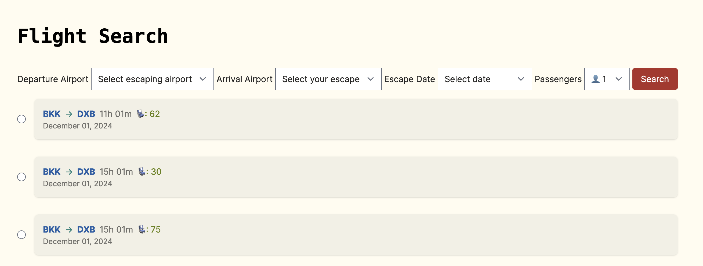
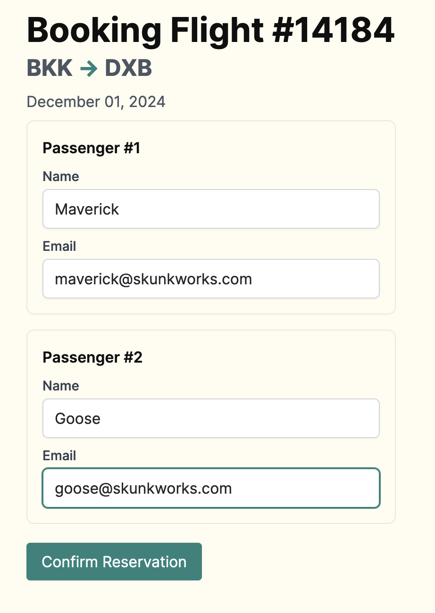
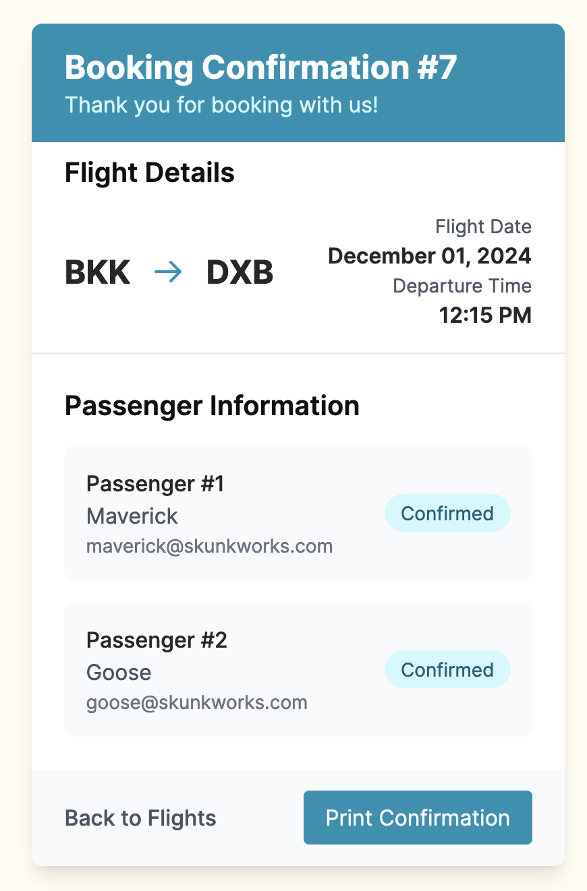

# The Odin Project Instructions

Build a typical airline booking flow:

  1. Enter desired dates / airports and click “Search”
  2. Choose from among a list of available flights
  3. Enter passenger information for all passengers
  4. Enter billing information

See more details [here](https://www.theodinproject.com/lessons/ruby-on-rails-flight-booker)

## My solution

Some screenshots of the finished project below:

